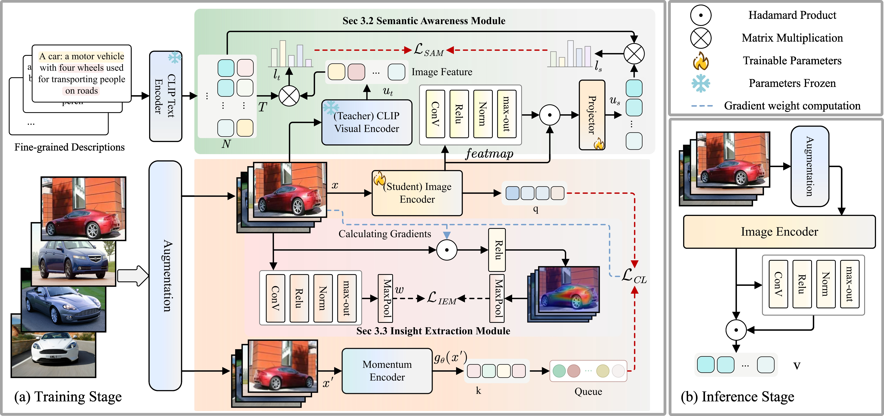

# LearnMat: Semantic-Aware Self-Supervised Fine-Grained Visual Recognition

Official PyTorch implementation of the paper:

**LearnMat: Semantic-Aware Self-Supervision for Fine-Grained Visual Recognition**  
*IEEE Transactions on Image Processing (TIP), 2026*

📄 Paper: https://ieeexplore.ieee.org/document/11433510

---

## Overview

Fine-grained visual recognition (FGVR) aims to distinguish visually similar subcategories (e.g., bird species, car models, and aircraft variants). However, existing self-supervised learning methods often fail to capture the subtle semantic differences required for such tasks.

To address this issue, we propose **LearnMat**, a semantic-aware self-supervised learning framework that improves fine-grained representation learning by focusing on subtle discriminative features while reducing irrelevant interference.



## Environment

Install the required packages:

```bash
pip install -r requirements.txt
```

## Datasets
We list several commonly used fine-grained visual recognition datasets below.  
For additional datasets used in the paper, please refer to their official websites for download.

| Dataset       | Download Link                                         |
| ------------- | ----------------------------------------------------- |
| CUB-200-2011  | https://paperswithcode.com/dataset/cub-200-2011       |
| Stanford Cars | http://ai.stanford.edu/~jkrause/cars/car_dataset.html |
| FGVC Aircraft | http://www.robots.ox.ac.uk/~vgg/data/fgvc-aircraft/   |

Please organize the dataset in the following structure:

```text
LearnMat
|-- CUB200/
    |-- train/
    |-- test/
|-- StanfordCars/
    |-- train/
    |-- test/
|-- Aircraft/
    |-- train/
    |-- test/
```

When running experiments, replace the dataset root with your own local path.

The training and evaluation scripts expect the dataset root to contain `train/` and `test/` subdirectories.

## Repository Structure

- `main.py`: pretraining and retrieval evaluation
- `main_lincls.py`: linear classification evaluation
- `requirements.txt`: Python dependencies

## Usage

### 1. Pre-training and retrieval

```bash
python main.py --epochs 100 -a resnet50 --lr 0.03 --batch-size 128 --multiprocessing-distributed --world-size 1 --rank 0 /path/to/your/dataset_root/ --mlp --moco-t 0.2 --aug-plus --cos
```

We provide the pretrained checkpoints corresponding to the results reported in the paper:

🔗 https://drive.google.com/drive/folders/1kzvdy9wbiTdePNFfHsnwPwSwHjlGKSTs

You can download a checkpoint from the link above and use it directly for retrieval evaluation.

### 2. Retrieval Evaluation

```bash
python main.py --resume /path/to/your/checkpoint.pth.tar --evaluate -a resnet50 --batch-size 128 --multiprocessing-distributed --world-size 1 --rank 0 /path/to/your/dataset_root/ --mlp --moco-t 0.2 --aug-plus --cos
```

The `--resume` argument should point to a pretrained checkpoint produced in Stage 1, or a checkpoint downloaded from the Google Drive link above.

### 3. Linear Classification Evaluation

```bash
python main_lincls.py -a resnet50 --lr 30.0 --batch-size 256 --pretrained /path/to/your/checkpoint.pth.tar --dist-url 'tcp://localhost:10001' --multiprocessing-distributed --world-size 1 --rank 0 /path/to/your/dataset_root/CUB --class_num 200
python main_lincls.py -a resnet50 --lr 30.0 --batch-size 256 --pretrained /path/to/your/checkpoint.pth.tar --dist-url 'tcp://localhost:10001' --multiprocessing-distributed --world-size 1 --rank 0 /path/to/your/dataset_root/StanfordCars --class_num 196
python main_lincls.py -a resnet50 --lr 30.0 --batch-size 256 --pretrained /path/to/your/checkpoint.pth.tar --dist-url 'tcp://localhost:10001' --multiprocessing-distributed --world-size 1 --rank 0 /path/to/your/dataset_root/Aircraft --class_num 100
```